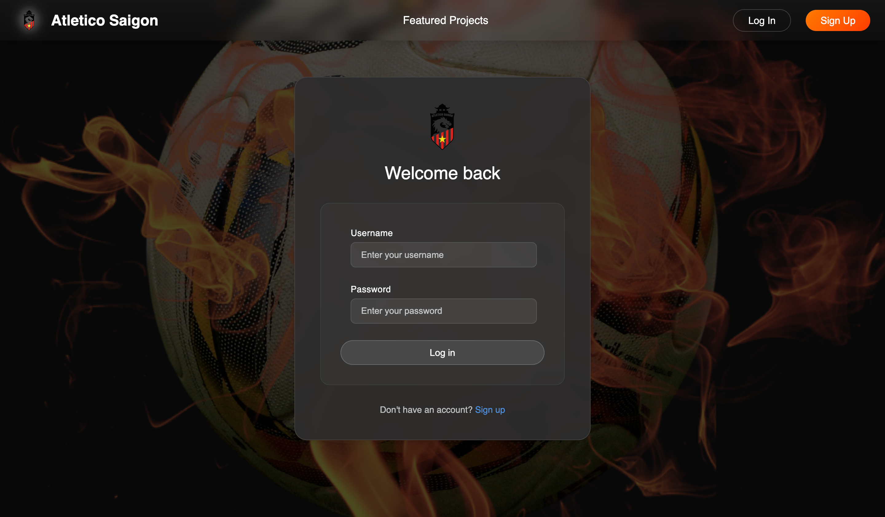
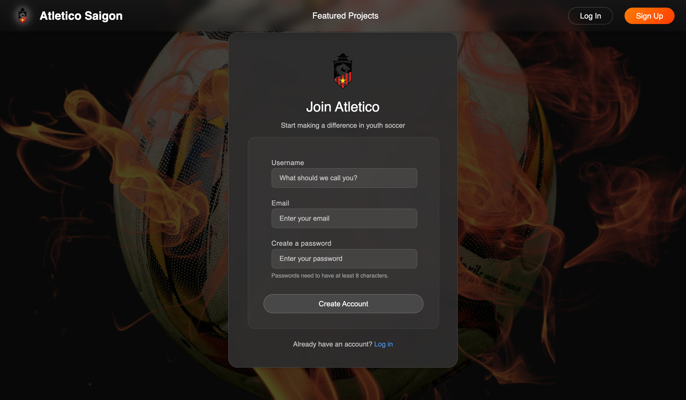
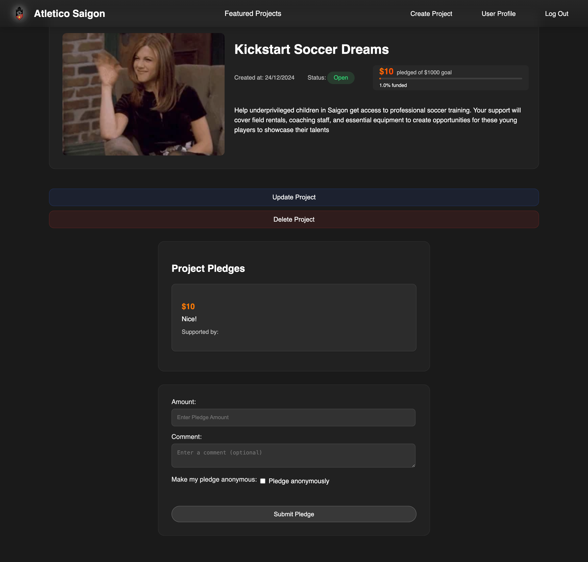
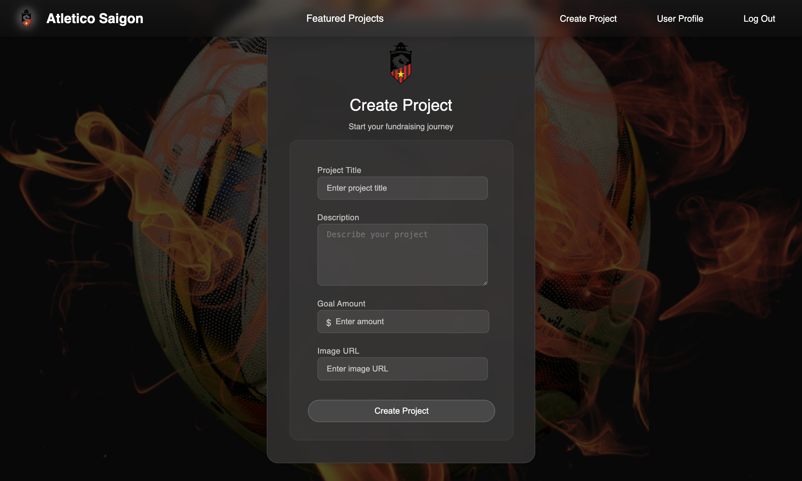
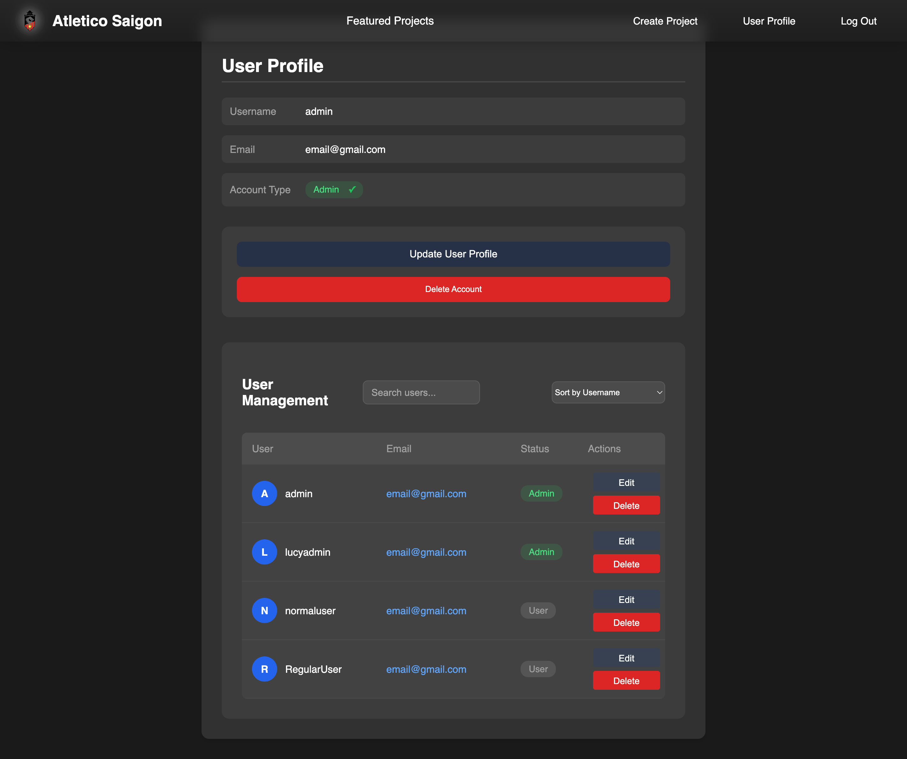
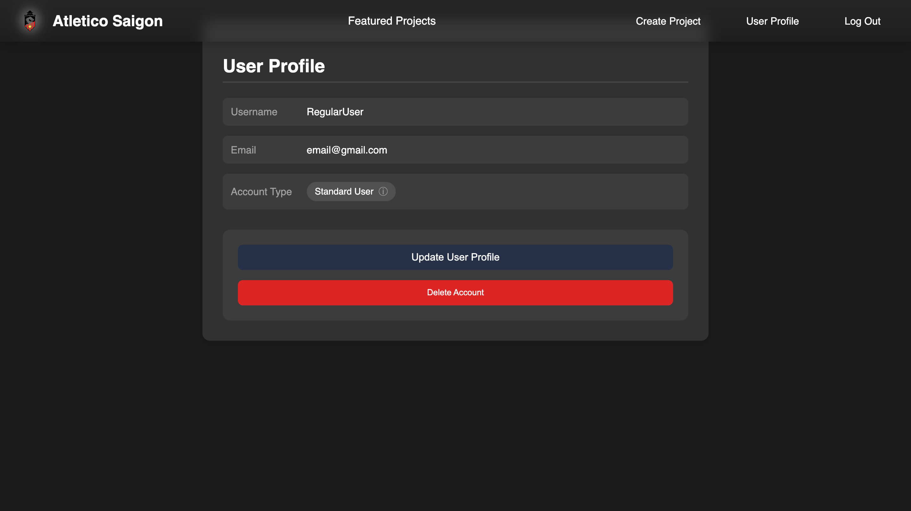

# Crowdfunding Front End for Atletico Saigon
> A React-based crowdfunding platform designed to support youth soccer initiatives. 
> The platform enables users to create and manage fundraising projects, make pledges, and track funding progress in real-time. Features include project creation, anonymous pledging, funding progress tracking, and a responsive modern UI.
---
 👩‍💻 Developed by Lucy Nguyen

## 🚀Live Demo: <https://atleticosaigon.netlify.app/>

> 🔗 This project is the front end of the Atletico Saigon crowdfunding platform. The back end is built using Django Rest Framework and can be found at <https://github.com/duong-28/crowdfuning_back_end>
> 📸 Scroll down for visual previews!

## 🔐 User Access Levels
**Admin**
- Full access to projects: can view, create, update, and delete projects.
- Can view and make pledges (with the option to pledge anonymously).
- Can view, update, and delete their own profile and all other users' profiles.

**Registered Users**
- Can view projects, create new projects, and update projects they have created.
- Can view and make pledges (with the option to pledge anonymously).
- Can view, update, and delete their own profile.

**Visitors**
- View active projects
- Make anonymous pledges

## 🌟 Key Features
Each project page shows:
- Funding goal and current amount pledged
- Project status (Open/Closed)
- Visual progress bar
- List of pledges
- Update/delete options for project owners and admins

## 🛣️ Future Enhancements
- Enhanced pledge management for administrators and pledge owners
- Advanced project lifecycle management including reopening closed projects
- Expanded analytics and reporting capabilities
- Integration with additional payment gateways
- A more grasping user interface with animations and transitions for Project page.

> Technologies used: React, JavaScript, HTML, CSS, Material-UI, Axios, React Router, React Hook Form, and Netlify for deployment.

### 💻 She Codes Project Requirements/Specs

- [x] Be separated in to two distinct projects: an API built using the Django Rest Framework and a website built using React.
- [x] Have a unique and creative project name (bonus points for puns and missing vowels!).
- [x] Define a clear target audience for the platform.
- [x] Implement user accounts with the following attributes:
    - [x] Username
    - [x] Email address
    - [x] Password
- [x] Enable users to create a "project" to be crowdfunded with at least these attributes:
    - [x] Title
    - [x] Owner (a user)
    - [x] Description
    - [x] Image
    - [x] Target amount to fundraise
    - [x] Status of accepting new supporters (open/closed)
    - [x] Creation date
- [x] Allow users to make "pledges" to a project, including at least these attributes:
    - [x] Amount
    - [x] The project the pledge is for
    - [x] The supporter/user (who created the pledge)
    - [x] Option for anonymous pledging
    - [x] Comment on the pledge
- [x] Implement suitable update/delete functionality, e.g., define if a project owner can update project details.
- [x] Define permissions, e.g., specify who can delete a pledge.
- [x] Return relevant status codes for both successful and unsuccessful API requests.
- [x] Handle failed requests gracefully (e.g., implement a custom 404 page instead of a default ev rror page).
- [x] Use Token Authentication, including an endpoint for obtaining a token along with the current user's details.
- [x] Ensure responsive design for mobile and desktop compatibility.

### 📸 Application Highlights

### Homepage

### Login Page

### SignUp Page

### Project Page

### Create Project Form

### Admin Profile Page

### Regular User Profile Page

### Unauthorised User can only view projects and make pledges anonymously
